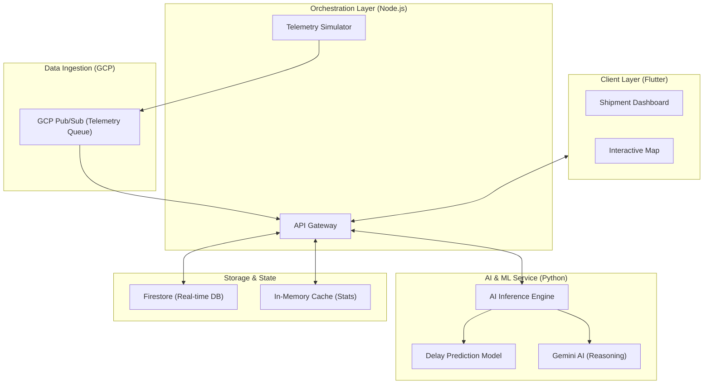

# 🧠 Smart Supply Chain Management

### **AI-Powered Logistics Decision Engine & Multi-Modal Orchestration**
*Developed by Team Trinamites*

---

## 📌 Overview

**Smart Supply Chain Management** is an enterprise-grade logistics platform designed to bridge the visibility gap in modern transportation. By integrating real-time telemetry with contextual intelligence (weather, traffic, and global news), the system doesn't just track shipments—it predicts disruptions and generates actionable mitigation strategies.

The platform monitors multi-modal transportation across **Road, Air, and Sea**, processing high-velocity telemetry data via a robust cloud architecture to provide live risk scoring and dynamic route optimization.

---

## 🚀 Core Features

*   **Real-Time Multi-Modal Tracking**: Interactive map-based tracking for road vehicles, aircraft, and sea vessels with live telemetry updates.
*   **Predictive Disruption Detection**: Automated identification of delays caused by traffic congestion, adverse weather conditions, or local incidents (accidents, strikes).
*   **Smart Route Optimization**: Dynamic recalculation of routes based on real-time risk factors and multi-objective ranking.
*   **Intelligent Risk Scoring**: A comprehensive dashboard categorizing shipment safety into **Low, Medium, and High** risk levels using multi-factor AI analysis.
*   **Unified Alert System**: Instant notifications and operational recommendations delivered to dispatchers when disruptions are detected.
*   **Cloud-Native Data Processing**: High-throughput telemetry ingestion and asynchronous processing powered by Google Cloud.

---

## 🏗️ System Architecture

The system utilizes a decoupled microservices architecture to ensure scalability and separation of concerns between data ingestion, business logic, and AI inference.



---

## 🔄 System Workflow

1.  **Telemetry Ingestion**: High-velocity location data is published to **Google Cloud Pub/Sub**, ensuring decoupled and reliable message delivery.
2.  **Stream Processing**: The **API Gateway** consumes telemetry, performing timestamp-based validation to prevent stale data updates.
3.  **Contextual Enrichment**: For every update, the system fetches live traffic, weather, and news data via REST APIs.
4.  **AI Analysis**: The **Python ML Service** calculates a risk score using a custom-trained prediction model and generates human-readable recommendations via **Gemini AI**.
5.  **State Synchronization**: Results are persisted in **Firestore**, triggering immediate UI updates on the Flutter dashboard via real-time listeners.
6.  **Simulation Resilience**: If the server restarts, the system recovers active simulation sessions from the persistence layer to maintain continuity.

---

## 🔧 Production Hardening & Fixes

This MVP has undergone rigorous technical audits and hardening to ensure production readiness:

*   **AI Reliability**: Fixed invalid model usage by migrating to verified production-stable models; centralized scoring logic to ensure consistency across all transport modes.
*   **Concurrency & Integrity**: Implemented **timestamp-based protection** against stale telemetry to resolve race conditions during high-frequency updates.
*   **System Resilience**: 
    *   Added **Persistence Recovery** for simulation sessions, allowing the system to resume operations seamlessly after a server restart.
    *   Fixed **Pub/Sub retry loop issues** by implementing proper poison message handling (preventing system crashes from malformed data).
*   **Performance Optimization**:
    *   Reduced **Firestore read load** by implementing intelligent throttling.
    *   Optimized dashboard responsiveness using **server-side caching** for aggregated statistics.
*   **Security**: Eliminated hardcoded secrets; enforced strict **environment-based security** and IAM-compliant credential management.
*   **UX Improvements**: Adjusted prediction logic for multi-modal accuracy and refined AI output formatting for clearer dispatcher communication.

---

## ⚙️ Tech Stack

*   **Backend (Orchestration)**: Node.js (Express)
*   **AI Service (ML & Reasoning)**: Python (FastAPI, Scikit-learn)
*   **Frontend**: Flutter (Dart) for Web/Mobile
*   **Database**: Google Cloud Firestore (NoSQL, Real-time)
*   **Messaging**: Google Cloud Pub/Sub
*   **AI Models**: Gemini 2.5 flash lite (Reasoning), Custom Regression Models (Delay Prediction)
*   **External APIs**: Google Maps Platform, OpenWeather, NewsAPI

---

## 💰 Cost & Resource Optimization

The system is architected for maximum efficiency, specifically targeting **free-tier compliance** while maintaining performance:

*   **Intelligent Throttling**: Reduces Firestore write costs by bundling telemetry updates without losing path accuracy.
*   **Optimized API Call Pattern**: Caches weather and traffic data per region to avoid redundant external API hits.
*   **Pub/Sub Efficiency**: Uses standard topics with optimized message retention policies to minimize ingestion costs.
*   **Lightweight Inference**: The Python service uses optimized ML models for rapid scoring before calling heavy LLM reasoning only when high-risk thresholds are met.

---

## 🛠️ Setup & Installation

### 1. Prerequisites
- Node.js (v18+) & Python (v3.10+)
- Flutter SDK
- Google Cloud Project with Pub/Sub & Vertex AI enabled
- API Keys: Google Maps, Weather, News

### 2. Backend Configuration
**API Gateway (Node.js):**
```bash
cd backend/api-gateway
npm install
# Configure .env with GOOGLE_MAPS_KEY, FIREBASE_CREDENTIALS, etc.
npm start
```

**AI Service (Python):**
```bash
cd backend/ai-service
python -m venv venv
source venv/bin/activate
pip install -r requirements.txt
uvicorn main:app --port 8000
```

### 3. Frontend Configuration
```bash
cd frontend
flutter pub get
flutter run -d chrome
```

---

## 📂 Project Structure

```text
smart-supply-chain-management/
├── backend/
│   ├── api-gateway/       # Node.js orchestration & Pub/Sub consumer
│   │   ├── controllers/   # Analysis & Shipment logic
│   │   ├── services/      # Cloud API integrations
│   │   └── simulator.js   # Production-hardened telemetry engine
│   └── ai-service/        # Python ML & Gemini integration
│       └── main.py        # Risk scoring & recommendation logic
├── frontend/              # Flutter UI (Clean Architecture)
│   ├── lib/controllers/   # State management (GetX/Provider)
│   └── lib/modules/       # UI Screens (Dashboard, Map)
└── delay_model.pkl        # Pre-trained ML weight file
```

---

## 📸 Screenshots
*(Visuals showing the live dashboard, map-based tracking, and AI-generated risk alerts)*
> [!NOTE]
> Screenshots will be added upon final deployment verification.

---

## 🔗 Links
- **Project Repo**: [GitHub Link](https://github.com/Ragavendra0604/Smart-Supply-Chain-Management)
- **Demo Video**: [YouTube Link Placeholder]
- **Documentation**: [Wiki Link Placeholder]

---

## 🔮 Future Scope
*   **Enhanced Multi-Modal Nodes**: Deeper integration with specific maritime and aviation flight-aware APIs.
*   **Blockchain Integration**: Immutable ledger for shipment handover points to increase trust.
*   **Dynamic Batching**: Further optimization of telemetry throughput for fleet-scale operations.
*   **Mobile Companion App**: Dedicated driver interface for real-time route acknowledgement and incident reporting.

---

### **Team Trinamites**
*Excellence in AI-Driven Logistics*
