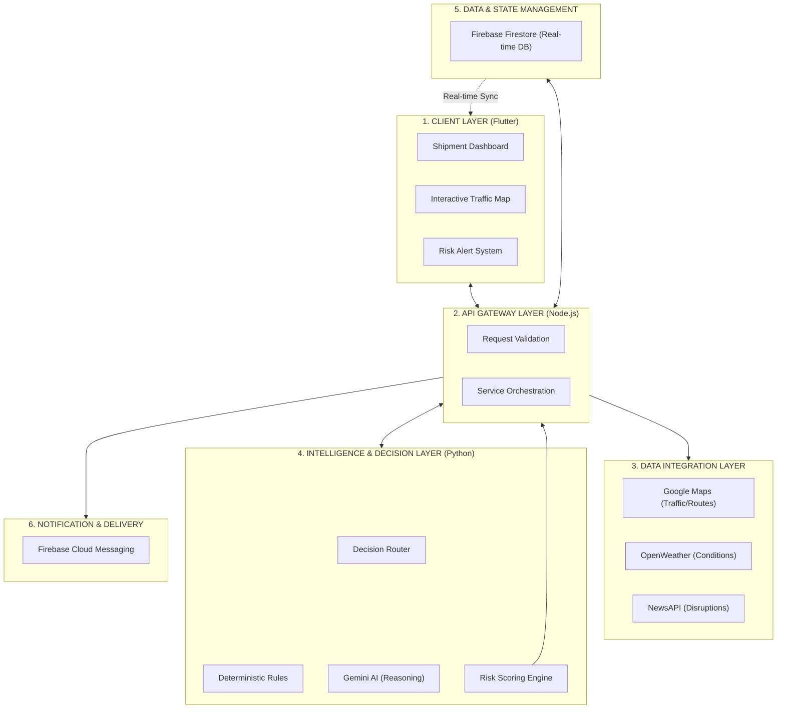

# 🚚 Smart Supply Chain Management MVP

An AI-driven logistics decision engine designed for the **Google Solution Challenge 2026**. This platform provides real-time shipment tracking, predictive risk assessment, and intelligent route optimization by aggregating data from Google Maps, Weather, and News APIs.

---

## 🌟 Overview

The **Smart Supply Chain Management** platform solves the visibility gap in modern logistics. Instead of just showing a dot on a map, it provides **contextual intelligence**. It answers not just *where* a shipment is, but *why* it might be delayed and *what* the driver should do about it.

### 🔄 Continuous Monitoring Loop
The platform operates on a closed-loop system to ensure constant reliability:
1.  **Monitor**: Continuous tracking of vehicle coordinates via the simulator/GPS.
2.  **Analyze**: Real-time correlation with weather alerts and traffic congestion.
3.  **Optimize**: Automated re-routing suggestions if the current path becomes high-risk.
4.  **Notify**: Instant push notifications via FCM for critical disruptions.
5.  **Update**: Real-time Firestore sync ensures the UI reflects the latest intelligence.

### Core Value Proposition
- **Live Risk Scoring**: Combines traffic congestion, weather severity, and local news (accidents, strikes) into a single 0-1 risk score.
- **AI Reasoning**: Uses Gemini (Vertex AI) to generate human-readable operational recommendations.
- **Dynamic Optimization**: Re-calculates risks and routes from the vehicle's **live location**, not just the starting point.
- **Glassmorphism UI**: A premium, modern Flutter dashboard designed for professional dispatchers.

---

## 🏗️ System Architecture

The system follows a microservices-inspired architecture to separate data ingestion (Node.js) from intelligence generation (Python).



---

## 🚀 Tech Stack

| Layer | Technology |
|---|---|
| **Frontend** | Flutter (Dart), Google Maps Flutter, Provider (State Mgmt) |
| **API Gateway** | Node.js, Express.js, Firebase Admin SDK |
| **AI Engine** | Python 3.11+, FastAPI, Google GenAI SDK |
| **Database** | Firebase Firestore |
| **Infrastructure** | Vertex AI, Google Cloud Platform |

---

## 📂 Project Structure

```text
smart-supply-chain-management/
├── backend/
│   ├── api-gateway/          # Express.js Server
│   │   ├── controllers/      # Business logic (Shipment analysis)
│   │   ├── services/         # API wrappers (Maps, Weather, News)
│   │   ├── routes/           # Endpoint definitions
│   │   ├── simulator.js      # Vehicle movement simulator
│   │   └── index.js          # Entry point
│   └── ai-service/           # Python FastAPI Server
│       └── main.py           # Risk logic & Gemini integration
├── frontend/                 # Flutter Application
│   ├── lib/
│   │   ├── models/           # Data structures
│   │   ├── modules/          # Screen-based features (Dashboard, Map)
│   │   ├── controllers/      # Frontend state logic
│   │   └── widgets/          # Reusable UI components
└── README.md
```

---

## 🛠️ Setup & Installation

### 1. Prerequisites
- [Flutter SDK](https://docs.flutter.dev/get-started/install)
- [Node.js](https://nodejs.org/) (v18+)
- [Python](https://www.python.org/) (3.10+)
- A Google Cloud Project with Vertex AI enabled
- API Keys for: Google Maps, OpenWeather, and NewsAPI.org

### 2. Backend - API Gateway
```bash
cd backend/api-gateway
npm install
```
Create a `.env` file:
```env
PORT=5000
GOOGLE_MAPS_API_KEY=your_key
WEATHER_API_KEY=your_key
NEWS_API_KEY=your_key
AI_SERVICE_URL=http://localhost:8000/predict
```
*Note: Place your `serviceAccountKey.json` from Firebase in this folder.*

### 3. Backend - AI Service
```bash
cd backend/ai-service
python -m venv venv
venv\Scripts\activate  # Windows
pip install -r requirements.txt
```
*Note: Ensure you have `gcloud auth application-default login` configured.*

### 4. Frontend - Flutter
```bash
cd frontend
flutter pub get
```

---

## 🚦 How to Run the Demo

1.  **Start AI Service**: 
    ```bash
    cd backend/ai-service
    uvicorn main:app --port 8000
    ```
2.  **Start API Gateway**: 
    ```bash
    cd backend/api-gateway
    npm start
    ```
3.  **Start Simulator**:
    ```bash
    cd backend/api-gateway
    node simulator.js
    ```
4.  **Run Flutter**: 
    ```bash
    cd frontend
    flutter run -d chrome  # or your preferred emulator
    ```

---

## 📡 API Reference

| Endpoint | Method | Description |
|---|---|---|
| `/create-shipment` | `POST` | Initialize a new shipment in Firestore. |
| `/update-location` | `POST` | Update live lat/lng (used by simulator/GPS). |
| `/api/shipments/analyze` | `POST` | Trigger multi-modal AI analysis for a shipment. |
| `/predict` (AI Service) | `POST` | Core risk scoring and Gemini reasoning engine. |

---

## 🏆 Evaluation Criteria Alignment

### Technical Merit
- **Microservices Design**: Decoupled Python AI and Node.js Gateway.
- **Robust Error Handling**: Comprehensive fallbacks if external APIs fail.
- **Real-Time Sync**: Firestore listeners ensure the dashboard updates instantly.

### Innovation
- **Multi-Modal Risk**: Unlike standard GPS, it interprets *news* and *weather* context.
- **Actionable AI**: Doesn't just report data; it suggests concrete operational strategies.

### Visual Excellence
- High-fidelity Flutter UI with responsive maps.
- Real-time traffic layer integration for visual verification.
- Dynamic color-coding for risk levels (Low/Medium/High).

---

## 📄 License
Distributed under the MIT License. See `LICENSE` for more information.
