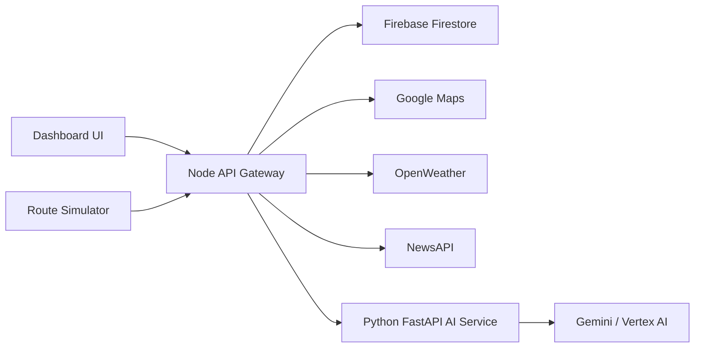

# Smart Supply Chain Management MVP

An AI-driven logistics decision engine that tracks a simulated shipment, collects live route/weather/news signals, predicts delay and risk, and stores the latest shipment intelligence in Firebase for a live dashboard.

## Problem Definition

Logistics teams often react to delivery delays after they have already affected customers. Traffic congestion, weather changes, route disruptions, and poor visibility make it difficult for dispatchers to understand shipment risk early enough to act.

This prototype addresses that gap by combining live shipment movement, real-world context, and AI reasoning into one operational dashboard.

## Solution

The system continuously tracks shipment status and uses external data to produce a live risk assessment:

- Google Maps route and traffic duration.
- OpenWeather destination weather.
- NewsAPI contextual disruption signals.
- Gemini via a Python AI service for a short delay/risk explanation.
- Firebase Firestore for live shipment storage.
- Browser dashboard for operators to create, analyze, and monitor shipments.

## Expected Impact

For dispatchers and small logistics operators, the prototype can reduce uncertainty by showing:

- Where the shipment is.
- Whether the route is risky.
- How much delay is expected.
- Why the delay is happening.
- What action should be taken next.

## Architecture



## Project Structure

```text
backend/
  api-gateway/
    index.js
    simulator.js
    public/
      index.html
      styles.css
      app.js
    controllers/
    routes/
    services/
    utils/
  ai-service/
    main.py
    requirements.txt
```

## Setup

### API Gateway

```bash
cd backend/api-gateway
npm install
copy .env.example .env
npm start
```

Set these values in `.env`:

```text
PORT=5000
GOOGLE_MAPS_API_KEY=...
WEATHER_API_KEY=...
NEWS_API_KEY=...
AI_SERVICE_URL=http://localhost:8000/predict
```

Place the Firebase Admin SDK key at:

```text
backend/api-gateway/serviceAccountKey.json
```

Do not commit `.env` or `serviceAccountKey.json`.

### AI Service

```bash
cd backend/ai-service
python -m venv venv
venv\Scripts\pip install -r requirements.txt
venv\Scripts\python -m uvicorn main:app --host 127.0.0.1 --port 8000
```

The AI service uses Google application credentials with Vertex AI access.

## Running The Prototype

1. Start the Python AI service on port `8000`.
2. Start the Node API gateway on port `5000`.
3. Open `http://localhost:5000`.
4. Create a shipment.
5. Click `Analyze`.
6. Click `Start Demo` to move the shipment along the route.

## Main API Endpoints

| Method | Endpoint | Purpose |
|---|---|---|
| GET | `/health` | Gateway health check |
| GET | `/api/shipments` | List recent shipments |
| GET | `/api/shipments/:shipment_id` | Get one shipment |
| POST | `/create-shipment` | Create shipment |
| POST | `/update-location` | Update live coordinates |
| POST | `/api/shipments/analyze` | Fetch external signals and run AI prediction |
| POST | `http://localhost:8000/predict` | AI delay/risk prediction |

## Evaluation Criteria Mapping

### Technical Merit

- Separate Node and Python services.
- Firebase integration.
- Real external API integrations.
- AI-generated operational explanation.
- Validated request inputs.
- Dashboard endpoints for live data reads.
- Basic automated tests.

### User Experience

- Operator dashboard for shipment creation, analysis, and monitoring.
- Visual route tracking without requiring direct Firebase access in the browser.
- Risk, delay, suggestion, weather, route, and disruption panels.
- Responsive layout and labeled form controls.

### Alignment With Cause

- Targets real logistics uncertainty caused by traffic, weather, and disruptions.
- Helps operators respond earlier with clearer risk signals.
- Designed for dispatchers and small fleet operators.

### Innovation And Creativity

- Combines simulation, live APIs, Firebase, and AI reasoning into one decision loop.
- Uses AI for contextual explanation and action recommendation, not only text generation.
- Can evolve into real GPS tracking, multi-shipment control, driver notifications, and historical ML.

## Prototype Limits

- Shipment movement is simulated, not from real GPS hardware.
- No production authentication layer yet.
- No historical ML training yet.
- External API availability and credentials are required for full analysis.

## Tests

```bash
cd backend/api-gateway
npm test
```
